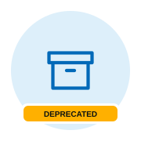

<h1 align="center">publish-codex-plugin</h1>

<p align="center">
  
</p>

<p align="center">
  Prepare a Codex plugin release archive.
</p>

<p align="center">
  <a href="https://github.com/tanaabased/actions/actions/workflows/pr-publish-codex-plugin.yml"></a>
</p>

**Deprecated for new Codex plugin releases.** Use [`npm-pack`](../npm-pack/README.md)
→ [`publish-npm`](../publish-npm/README.md) for npm distribution. This v1 action
still prepares and optionally uploads a release archive for existing callers.
Removing it requires a breaking release after known callers have migrated or
have an explicit supported archive alternative.

Supported runner: Linux (`ubuntu-24.04`).

## Usage

For npm distribution, build all required runtime files before packing:
`npm-pack` disables package scripts, and Codex does not run install-time
lifecycle scripts. Inspect and test the **extracted npm tarball**, including
the plugin manifest, every required resource it references, and packaged runtime
code. Exercise runtime entry points from the extracted package, not the source
checkout. Only then pass the **same tarball** to `publish-npm`:

```yaml
- id: pack
  uses: tanaabased/actions/npm-pack@v1
- name: Verify extracted plugin package
  env:
    TARBALL: ${{ steps.pack.outputs.tarball-path }}
  run: |
    package_root="$(mktemp -d)"
    tar -xzf "$TARBALL" -C "$package_root"
    test -f "$package_root/package/.codex-plugin/plugin.json"
    ./scripts/check-plugin-package.sh "$package_root/package"
- uses: tanaabased/actions/publish-npm@v1
  with:
    tarball: ${{ steps.pack.outputs.tarball-path }}
```

The caller-owned `check-plugin-package.sh` must check the plugin's actual
required resources and execute a smoke test of its packaged runtime code; the
paths and commands depend on that plugin. See each action's README for setup,
credentials, and release behavior. [`validate-codex-plugin`](../validate-codex-plugin/README.md)
remains supported for plugin validation.

For existing archive consumers, live upload requires job-level `contents: write`
permission and a token with access to the target repository:

```yaml
permissions:
  contents: write

steps:
  - uses: actions/checkout@v7
    with:
      ref: ${{ github.sha }}
  - name: Publish Codex plugin archive
    id: publish
    uses: tanaabased/actions/publish-codex-plugin@v1
    with:
      plugin-directory: .
      archive-name: tanaab-${{ github.event.release.tag_name }}.tar.gz
      dependency-policy: include-production
      release-tag: ${{ github.event.release.tag_name }}
      github-token: ${{ github.token }}
```

Run generic and repository-specific validation before publication; this action
owns archive preparation and upload, not consumer policy checks or manifest
stamping. For parallel release jobs, follow the
[shared checkout guidance](../publish-repo/README.md#usage).

## Inputs

| Input | Required | Default | Description |
| --- | --- | --- | --- |
| `dry-run` | No | `false` | Prepare the real archive without uploading it or requiring credentials. |
| `debug` | No | `auto` | `auto`, `true`, or `false`; `auto` enables diagnostics when `RUNNER_DEBUG=1`. |
| `plugin-directory` | No | `.` | Plugin root to archive, relative to the workspace or absolute. |
| `archive-name` | Yes | — | Archive filename ending in `.tar.gz`, using letters, digits, dots, underscores, or hyphens. |
| `dependency-policy` | No | `include-production` | `include-production` or `exclude-node-modules`. |
| `bun-version` | No | `auto` | [Project discovery](../setup-bun/README.md) or explicit Bun version. |
| `release-tag` | Yes | — | Existing GitHub Release tag that receives the archive. |
| `repository` | No | `${{ github.repository }}` | GitHub repository containing the release. |
| `github-token` | Live publication | — | Token with `contents: write`; omit in dry runs. |

For a consumer pull-request dry run, set `dry-run: true`. It validates inputs
and builds the real archive, but skips release upload. Archive
outputs remain meaningful; a live release proves delivery.

Runtime discovery uses `plugin-directory`. Debug enables verbose Bun output.

`include-production` removes the plugin root's existing `node_modules` and runs
`bun install --production --frozen-lockfile --ignore-scripts` before packing.
The resulting production `node_modules` is included. `exclude-node-modules`
does not install dependencies and excludes the root `node_modules` directory
entirely. Both policies exclude version-control metadata.

## Outputs

| Output | Description |
| --- | --- |
| `archive-path` | Absolute path to the prepared `.tar.gz` archive. |
| `archive-name` | Filename of the prepared archive. |

## Test behavior

Dry run prepares the real archive under `RUNNER_TEMP` without GitHub access.
PR tests compare unpacked contents for both dependency policies. Release access,
asset replacement, and download require a live consumer release.

## Notes

### Upload replacement and retries

Live mode calls `gh release upload` once with `--clobber`. An existing asset
with the same name is replaced; an absent release, invalid token, or failed
upload fails the action. The action does not retry automatically. Inspect the
release before rerunning after an ambiguous transport failure, then rerun the
workflow to replace the named asset. A successful upload command completes the action.
